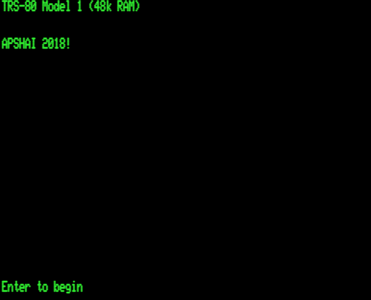

# APSHAI18: Temple of Apshai 2018! for the TRS-80

## Status of Project
Currently WIP. The dungeon is generated and you can move about (a bit).
Next step; treasures, monsters, traps etc...

## Introduction

_APSHAI18_ is a redeveloped version of the game "Temple of Apshai" for the [TRS-80](https://en.wikipedia.org/wiki/TRS-80), inspired by the original, but with some new ideas.

_APSHAI18_ is a remake in the style of the original, but with many new improvements. Graphically the TRS-80 is _really_ limited and the original game was painfully slow at redrawing the screen.

The remake renders the dungeon in real-time, with dynamic pan and zoom. That's on a _real_ TRS-80, not a modern emulator. Of course you still need to use your imagination as the graphic style is just as limited!

Another *great* feature of the remake is that the dungeon is *generated*. The dungeon is different for _every_ game! The placement of treasures, traps and monsters is then intelligently arranged for gameplay.

## Installing/Running

### Model I
The binary `APSHAI18.CAS` is a trs-80 model I SYSTEM CAS file, to be loaded through the cassette interface. Load using the following commands:

    SYSTEM (enter)
    *? (press A enter)

The program will load with flashing asterisks in the top right corner.
at the next `*?` prompt type `/` (enter).

The program will begin. 

### Model III

The file `APSHAI18.CMD` is a binary to put onto a floppy disk and run. Alternatively use the `APSHAI18.DSK` image of a floppy disk containing `APSHAI18/CMD`

### Model IV/4P

Boot into Model III mode and run as above. 

## Using an Emulator

If you don't have a real TRS-80 handy, you can run the game in an emulator. There are many excellent emulators around for the machine and even some web based ones.

I use the open source SDLTRS emulator, which is free and you can compile it yourself from scratch. There is a windows binary in the "emu" directory for convenience source code [here](https://github.com/voidware/sdltrswin).

From the `src` directory, start the emulator like this (see `go.bat`)

     ..\emu\sdltrs -model 1 -romfile ..\emu\model1.rom -scale 2 -cassette apshai18.cas

SDLTRS may be configured using the menu on F7. F11 is the "turbo" button, which you may find useful for speeding up loading.

For full details see, http://sdltrs.sourceforge.net/

You can also run _apshai18_ in the emulator under LDOS and LS-DOS. As a model III, run (see `go3.bat`):

    ..\emu\sdltrs -model 3 -romfile3 ../emu/model3.rom -scale 2 -disk0 "../emu/ld3-531.dsk" -disk1 "apshai18.dsk" -foreground 0x07e218 

After this command, type `APSHAI18` (enter) to run.

## Compiling Apshai18

The project is completely free and open source, hosted on github,
http://github.com/voidware/apshai18

Get your copy of the source repo with,

    git clone https://github.com/voidware/apshai18.git

The project compiles using the Small Device C Compiler (SDCC), which is free and open source, http://sdcc.sourceforge.net

Download and install the SDCC binaries and you're ready to go!

The build uses make (for windows either install cygwin or mingw). To build, go to the src directory and type make.

SDCC generates Intel HEX format "binaries". You need to convert these to TRS80 CAS format. There is a utility in tools/mksys that performs this conversion. There is a windows mksys.exe compiled binary for convenience, otherwise you'll have to compile the mksys.cpp program yourself - which is only the one file with no dependencies.

The conversion from IHX to CAS is done automatically by the makefile using this  mksys utility.

## Playing The Game

### Status Panel

1. `ROOM NO. 52`  
   Current room or corridor.
2. `WOUNDS: 100%`  
   ie. not wounded.
3. `FATIGUE: 100%`  
   ie all endurance available.
4. `WGT: 42 LBS`  
   weight carried
5. `MONSTER SLAIN!`  
   Shows you killed the monster last fought, else blank.
   Also `NOTHING` (after search)
6. `CRUNCH!`
   status of your last attack. Also `SWISH`
7. `SHIELD HIT!`  
   Status of your last received attack. Also `STRUCK THEE`, `IT MISSED`.
8. `ARROWS: 23`  
   How many arrows.
9. `MAG AR: 0`  
   How many magic arrows.
10. `ANT MAN`  
   Current combat monster.
11. `TOTAL SLAIN: 21`  
   Monsters killed this foray.
12. Additional Info (eg `NONE LEFT`)

### Commands

Key | Description
--- | ---
D | Turn right 
A | Turn left
W | Walk forward
S | Walk backwards
T | Thrust
P | Parry
F | Fire normal arrow
M | Fire magic arrow
O | Open door
E | Examine wall for secret door or search for traps if not near a wall
G | Get treasure
D? | Drop some treasure
Q | Hearken (query)
! | Speak with monster
H | Apply healing salve
Y | Drink healing potion

Healing takes a turn

Original APSHAI Commands

Key | Description
--- | ---
0-9 | Move forward 0-9 feet
R | Turn right 
L | Turn left
V | Turn around (volte-face)
A | Attack
T | Thrust
P | Parry
F | Fire normal arrow
M | Fire magic arrow
O | Open door
E | Examine wall for secret door
S | Search for traps
G | Get treasure
D | Drop some treasure
Q | Hearken (query)
! | Speak with monster
H | Apply healing salve
Y | Drink healing potion

Turning does not take a turn.

   
### Money

* Copper Pieces
* Pieces of silver (= 10 copper)
* Gold coins (= 10 silver)

## Equipment

Armour

TYPE | WEIGHT | OFFERED PRICE
---- | -----  | -------------
LEATHER | 9 | 30
RING MAIL | 22 | 100
CHAIN MAIL | 31 | 150
PARTIAL PLATE | 47 | 250
FULL PLATE |63 | 1000

## Game Design

There are no role playing character attributes such as _strength_, _dexterity_ etc. Although these were in the original, nobody really played a game with anything less than perfect stats.

The original had 3 "monster speeds" (slow, medium, fast) which served to adjust difficulty. This didn't change the game speed, but instead the time you are given to react. 

* Items have weight which affect _fatigue_.

* Original had 4 dungeon levels, increasing in difficulty.

* Opening Doors?

* Secret doors? Face a wall and search with E

### Traps

Type | Levels
--- | ---
Lily | 1,4
Needle | 1,2
Pit | 1,2,4
Spear | 1,2,4
Mold | 1
Ceiling | 2
X-Bow | 2
Cave-in | 3
Dagger | 4
Flame | 4

Traps become visible once found with search.

### Treasure

Move to location with treasure, press G

Will then display the name of the treasure.

If you find a sword, it is swapped with your current sword _providing_ it is a better weapon.

Magical treasures:

* rings
* swords

Level 1:

Name | Description | Silver Value
--- | --- |---
T01 | Lilies (healing potion) | 0
T02 | Incense Moss | 30
T03 | Phosphorescent Algae | 5
T04 | Mithril (magic) shield
T05 | Food Algae x2 | 5
T06 | Mushrooms x2 | 6
T07 | Kelp x2 | 5
T08 | 4 Gold Pieces | 40
T09 | X Arrows with Silver Points x2 | X
T10 | 5 Small Diamonds x3 | 5x100
T11 | 8 Small Diamonds | 8x100
T12 | 4 Small Diamonds x3 | 4x100
T13 | 7 Small Diamonds | 7x100
T14 | deleted
T15 | Magic Sword and 2 gold pieces | 2 
T16 | 5 Magic arrows
T17 | Copper Ingot | 20
T18 | chest with 200 silver pieces and a diamond ring | 200+300
T20 | Worthless Items 

### Listening

You can sense the presence of another creature the other side of a wall, if you're close to the wall.

### Talking

Speaking with a monster may avoid combat, unless monster has been attacked or it's treasure touched.

### Combat

Attack monsters by moving into them (from any direction).

Thrust (T) is an all-out attack. it costs more fatigure.

Parry (P) allows rest during combat.

Fire an arrow.   `THWUNK`

When you're hit, shake screen with wide chars

### Death

`THOU ART SLAIN`

Benedic the cleric found thee, experience xxx, dost wish to re-enter?

### Generating the Dungeon

### Dungeon Entrance and Exit

Each dungeon will place an entrance door at the bottom left and and exit door at the top right.

